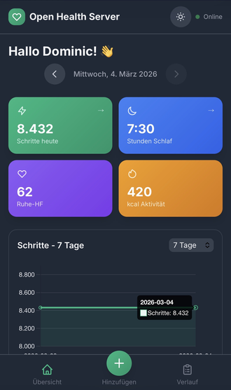

# Open Health Server

A self-hosted health tracking system with a web dashboard and REST API. Track your steps, sleep, heart rate, weight, and activity data.



## About

This project was created to make health data accessible for **AI Agents** and **OpenClaw-compatible** systems. The REST API allows automated agents to read and write health data, enabling intelligent health coaching, automated tracking, and integration with voice assistants and automation systems.

**Key Use Cases:**
- 🤖 **AI Agent Integration** - Automated health coaching and reminders
- 📱 **OpenClaw Compatible** - Works with OpenClaw automation systems
- 🔗 **API-First Design** - Easy integration with any system that can make HTTP requests
- 🏠 **Self-Hosted** - Your data stays on your own server

## Features

- 📊 **Web Dashboard** - Mobile-responsive UI with charts and statistics
- 🔌 **REST API** - FastAPI backend with automatic data synchronization
- 🔐 **Token-based Authentication** - Secure access control per user
- 🌍 **Multi-language** - German and English support
- 📱 **iOS App Support** - Ready for mobile app integration (HealthKit)
- 🐳 **Docker Support** - Easy deployment with Docker Compose

## Quick Start

### Using Docker (Recommended)

```bash
# Clone the repository
git clone https://github.com/digidomic/open-health-server.git
cd open-health-server

# Start with Docker Compose
docker-compose up --build -d

# Access the services
# Frontend: http://localhost:8080
# Backend: http://localhost:8000
```

### Manual Setup

**Backend:**
```bash
cd backend
python3 -m venv venv
source venv/bin/activate
pip install -r requirements.txt
python3 -m uvicorn main:app --host 0.0.0.0 --port 8000
```

**Frontend:**
```bash
cd frontend
python3 -m http.server 8080
```

## Configuration

### Adding Users

Edit `config.json` to add users with their access tokens:

```json
{
  "users": {
    "YourName": {
      "token": "your_secure_token_here",
      "language": "en",
      "units": "metric"
    }
  }
}
```

**Fields:**
| Field | Description | Example |
|-------|-------------|---------|
| `token` | Unique access key | `my_token_123` |
| `language` | Language: `de` or `en` | `en` |
| `units` | Units: `metric` (kg) or `imperial` (lbs) | `metric` |

Generate a secure token:
```bash
openssl rand -hex 16
```

**Important:** Restart the backend server after modifying `config.json`.

### Environment Variables

Create a `.env` file:

```env
PORT=8080              # Frontend port
BACKEND_PORT=8000      # API port
DATABASE_URL=sqlite:///./data/health.db
```

## API Endpoints

### Authentication
All endpoints require a `token` query parameter.

### Health Check
```bash
GET /health
```

### Get Health Data
```bash
GET /api/health?start_date=2026-01-01&end_date=2026-12-31&token=your_token
```

### Add/Update Entry
```bash
POST /api/health
Content-Type: application/json

{
  "datum": "2026-03-07",
  "schritte": 10000,
  "schlaf_stunden": 7.5,
  "schlaf_index": 85.0,
  "herzfrequenz_ruhe": 60,
  "herzfrequenz_avg": 75,
  "gewicht": 75.5,
  "aktivitaetsenergie": 500,
  "training_minuten": 45,
  "notizen": "Great day!"
}
```

### Delete Entry
```bash
DELETE /api/health/{id}?token=your_token
```

## Docker Commands

```bash
# View logs
docker-compose logs -f

# Restart services
docker-compose restart

# Stop everything
docker-compose down

# Update with latest code
git pull
docker-compose up --build -d
```

## Project Structure

```
open-health-server/
├── backend/           # FastAPI backend
│   ├── main.py       # API endpoints
│   ├── database.py   # SQLite models
│   └── Dockerfile    # Container config
├── frontend/         # Web dashboard
│   ├── index.html    # Main UI
│   ├── app.js        # Application logic
│   └── Dockerfile    # Nginx container
├── docker-compose.yml
└── README.md
```

## License

Backend & Frontend: MIT License

## Support

For issues and feature requests, please use the GitHub issue tracker.
